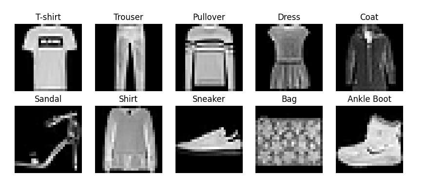
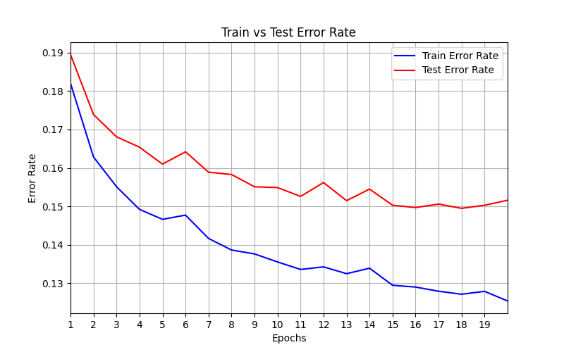
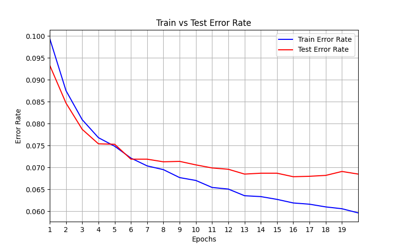

# The Fashion MNIST database

The FashionMNIST is a database of black and white 10 types of fashion items with resolution $28 \times 28$ as below

It is similar to the standard [MNIST database of handwritten digits](../mnist/mnist.md) 
in the sense that both are $28 \times 28$ grayscale images of 10 different categories,
with the same database size - 60000 train samples size, and 10000 test sample.

However, this database is harder to learn, and least using the simple network with only
linear layers, separated by ReLu nonlinear layers. For example, using the same learning rate
and batch size on a module with a single linear layer on both databases, and computing the error
rates per epoch, we see the following:

 

In the fashion database, after 20 epochs the training error is still more that $0.1$ and test error $0.15$, 
while in MNIST both error are less than $0.1$ already after the first epoch,