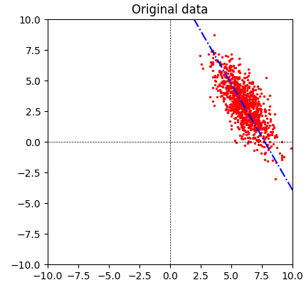
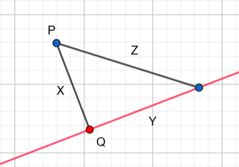
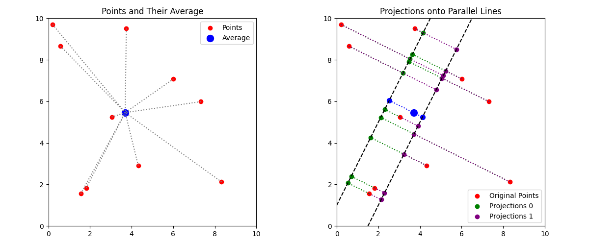

# PCA: What we want and how we get there

A big problem in learning, is that usually our data is in a very high dimensional space,
which is hard for us to understand (and more over, for the computer to compute).

Given this, we would like to somehow reduce the dimension in which we work, while retaining "most"
of the information of the data. There are several technique to do that, and here I will remind myself
(and you) how the principal component analysis (PCA) works.

As intuition, you should think about the following data samples in 2D, where if we project them on the 
blue line, we will lose information but not too much. The main problem of course is to find this blue line
and measure how much information we lost.
<p align="center"></p>

# The goal
Our data is in a $d$-dimensional space, and we would like to reduce it to some $k$ dimensional space
(with $k<d$ ). As we want to measure how much information we loose, we will think of it as a map $S:\mathbb{R}^d \to V'$
where $V'\leq \mathbb{R}^d$ is an affine subspace of dimension $k$, namely a translation of a standard linear space $V'=v_0+V$ 
where $V\leq \mathbb{R}^d$ is linear with $\dim(V)=k$. This way we can represent our points as $v_0+v$ where $v_0$ is fixed and 
$v$ is $d$-dimensional.

Then we can measure its "reconstruction" error:
$$\left\Vert{x-S(x)}\right\Vert^2.$$

### Probelm:
> Given $n$ data points $\{x_1,...,x_n\}$ in a $d$-dimensional space, and a dimension $k<d$, find such an affine $k$-dimensional
> subspace $V'$ and $S:\mathbb{R}^d\to V'$ which minimizes
>$$\min_{S, V'}{\sum_1 ^n \left\Vert{x_i - S(x_i)}\right\Vert^2}.$$

### Remark:
> There are other ways to measure how much information we retain. The main reason we use this one, is that it is 
> very "algebraic" as we shall see below, so we can apply all the tools in our linear algebra arsenal.

---
# Step 1: The center of the data

Consider the simple case where $k=0$, or equivalently we "approximate" all the data points with a single point $v_0$. 
Then the problem is
$$\min_{v_0}{\sum_1 ^n \left\Vert{x_i - v_0}\right\Vert^2}.$$
You can and should find $v_0$ using some simple derivatives (exercise). However, there is also an algebraic way to solve this 
problem. It is a bit of an overkill for this simple problem, but there are at least two good reasons to understand it:
- It gives another point of view on this problem, which is almost always a good thing, and
- it generalizes to higher dimension, which we will soon need.

If we use the $\left\Vert{\cdot}\right\Vert^2$ notation on a matrix to mean the sum of squares of all its entries, then our goal is to minimize:

```math
\left\Vert{\;
\left(\begin{array}{cccc} 
| & | &  & |\\ 
x_{1} & x_{2} & \cdots & x_{n}\\ 
| & | &  & | \end{array}\right) -
\left(\begin{array}{cccc} 
| & | &  & |\\ 
v_{0} & v_{0} & \cdots & v_{0}\\ 
| & | &  & | \end{array}\right)\;}\right\Vert^2.
```

Let us denote by $X\in \mathbb{R}^{d\times n}$ the first matrix which has $x_i$ as columns. The second matrix can be written 
as the product of column and row vectors $v_0 \cdot \bar{1} _ {n}^T$, so now we have the more compact form
$$\min_{v_0}\left\Vert {X - v_0\cdot \bar{1}_n^T }\right\Vert^2.$$

Why is this new form so interesting?
1. First, this is now a linear problem. Instead of $n$ different points and looking for some minimum to sum of square we have:
   - We now live in a $d\times n$-dimensional space,
   - It contains a single point $X$, 
   - for which we look the best approximation in a standard linear space of all vectors of the form $v_0\cdot \bar{1}_n^T$.
2. Second, we know very well how to solve this type of problem! This is just the orthogonal projection, which is half a step
   from the elementary and well known Pythagoras theorem: when approximating a point in a subspace, the line to that
   point must be perpendicular to the subspace. For example, in the image below, the point $Q$ is the closest point on 
   the red line to $P$ and the line between them is perpendicular to the red line. The reason that it is the closest,
   is that the distance to any other point, will satisfy $Z^2=X^2+Z^2\geq X^2$.

<p align="center"></p>

The world of inner products, where these orthogonal projections live, is a fascinating one (and if you speak Hebrew,
then I have some [video lecture series about them here](https://prove-me-wrong.com/teaching/inner-product-spaces-youtube-lectures-hebrew/)). I will not go too deep into the math there, but let's see 
how simple it is in $d=1$ (The general case is similar, but just with more indices).

## $d=1$ 

Now we simply have scalars $x_i$, and we want to approximate $\bar{x}=(x_1,...,x_n)$ using a constant vector $v_0(1,1,...,1)$.
What we need to do is then take a unit length vector at the direction of constant vectors, namely 
$$\frac{1}{\sqrt{n}}\cdot \bar{1}_n^T = \frac{1}{\sqrt{n}}(1,1,...,1),$$
and the best approximation will be
$$\left\langle\bar{x},\frac{1}{\sqrt{n}}\cdot \bar{1}_n\right\rangle \frac{1}{\sqrt{n}}\cdot \bar{1}_n^T = 
\frac{1}{n}\left\langle\bar{x},\bar{1}_n\right\rangle \cdot \bar{1}_n^T = \frac{\sum_1^n x_i}{n} \cdot \bar{1}_n^T.$$

In other words, we got the mean of $x_i$ times the constant $1$ vector.

## General $d$

In general, similar computations apply, but with more indices, and we reach a similar conclusion, where the best approximation 
of the matrix $X$ is just
$$\frac{1}{n} \left(\sum_1^n x_i\right)\cdot \bar{1}_n^T.$$

Note that the expression in the brackets is a $d$-dimensional vector, so the whole expression is a $d\times n$ matrix.
In other words:
> The best single-point approximation is the average of all the data points.

---
# Step 2: When $k>0$

As mentioned before, for the $k=0$ case a simple calculus derivative argument will work, however the algebraic approach
becomes much more powerful as we increase the dimension. For example consider the following problem:

### Problem:
> Consider the original problem for $k=1$, however we also semi-fix the affine subspace. We fix the nonzero vector $u_1$,
> and the space must be of the form $$u_0+\mathbb{R} \cdot u_1.$$ In other words, we try to reduce the dimension to 1, namely to lines
> but only to lines parallel to $u_1$. What can we say about $u_0$?

The same approach as above produce the minimization problem of 
$$\min_{u_0, \alpha_i}\left\Vert {X - u_0\cdot \bar{1}_n^T -u_1 \cdot (\alpha_1,...,\alpha_n)}\right\Vert^2.$$

Thus, just like before, we look for the best approximation of $X$ in the linear subspace:
$$V_1 = \{u_0\cdot \bar{1}_n^T + u_1 \cdot (\alpha_1,...,\alpha_n)\;:\;u_0\in \mathbb{R}^d, \alpha_i \in \mathbb{R} \}.$$

Yes, we made the space of all possible approximation to all of $x_i$ together into a linear space. And what is 
more interesting, is that this space, contains the subspace from before 
$$V_0 = \{v_0\cdot \bar{1}_n^T\;:\;v_0\in \mathbb{R}^d \}.$$

In our new space of $V_1$, when choosing the $u_0$ point, can we choose it to be the mean $\frac{1}{n}\sum x_i$ as in 
the previous section? In other words, can we ignore completely that we added an extra dimension, and still use the
same computation from before?

As it turns out, we can! There is probably also some derivative computation that shows that it holds here too, but it
is so much better when we have some algebraic-geometric intuition:

<p align="center"></p>

In the image above we have 10 red dots, and their blue average, which can be seen on the left.

On the right, we try to reduce their dimension to 1, but only on two lines parallel to one another (and in general, 
we look on all the line parallel to the direction $v_1$). The approximation from which one of these lines is better: the 
green or the purple? It is not that easy to see, since it is hard to understand sum of squares of distances of pairs 
of point. However, there is a very interesting phenomena here: Each triple of red dot, and the two green and purple 
projection are all on the same line, which more over is perpendicular to our direction $v_1$. So once we know what happens
on one such line, we "know" what happens on them all. **Even better**, the averages of the green projections $\mathbb{E}(green_i)$, 
the purple projection $\mathbb{E}(purple_i)$ and the average of the original red points $\mathbb{E}(red_i)$ are also on the same line 
perpendicular to $u_1$ !

Suddenly, our image is full of right angles and Pythagoras is just waiting around the corner:

```math
\begin{align}  
\sum_i\left\Vert{red_i-green_i}\right\Vert^2 & =\sum_i \left\Vert{red_i-\mathbb{E}(green_i)}\right\Vert^2-\sum_i\left\Vert{green_i-\mathbb{E}(green_i)}\right\Vert^2. \\
\sum_i\left\Vert{red_i-pruple_i}\right\Vert^2 & =\sum_i \left\Vert{red_i-\mathbb{E}(pruple_i)}\right\Vert^2-\sum_i\left\Vert{pruple_i-\mathbb{E}(pruple_i)}\right\Vert^2.
\end{align}
```

What we want to minimize the left hand side, and to choose either the green or purple projections.
The fact that the green and purple points on both lines are translations of on another ,shows that on the right
hand side above we have
$$\sum_i\left\Vert{green_i-\mathbb{E}(green_i)}\right\Vert^2 = \sum_i\left\Vert{pruple_i-\mathbb{E}(pruple_i)}\right\Vert^2.$$

We conclude, that instead of checking the distance from the different green\purple points, we can check the distances 
to their average, and compare them. But now we can use the previous section which tell us that **the best** single-point
approximation is the average of all red points! So if any line gives us the best approximation, it must pass through this average.

While everything here was a visual guess work from the image above, everything can be formalized using a little bit 
of algebra and inner products. The general result will be:

### Lemma
> When approximating $x_1,...,x_n$ into an affine space $v_0 + V$ for some linear subspace $V$, we can always
take $v_0=\frac{1}{n}\sum x_i$.

We can now do another homogenisation trick, and instead of approximating the $x_i$ in an affine space, we can approximate
$x_i - v_0$ with an actual linear subspace. However, this is exactly what we did so far, so again everything will
come down eventually to orthogonal projections.

Note that the "least" amount of data we can get is if $x_i=v_0$ for all $i$, namely all the points are the same. If we 
use our new "centered" data $Y=X-\mathbb{E}(X)\cdot \bar{1}_n^T$, then this is simply means that $Y=0$. So we have some new:

### Intuition
> The bigger $\left\Vert{Y}\right\Vert^2$ is, the "more" data we have.

We shall make this intuition more formal below.

---
# Step 3: Orthogonality and spectral decomposition

We can now reduce our discussion to the "simpler" problem:

### Probelm
> Fix $x_1,...,x_n\in \mathbb{R} ^d$ and some $k<d$. For a subspace $V\leq \mathbb{R} ^d$ of dimension $k$, let $P_V$ be the 
> orthogonal projection to that subspace. Minimize the following:
> $$\min_V\left\Vert{X-P_V (X)}\right\Vert^2.$$

### Remark
> The simplest orthogonal project to dimension $k$ is simply the projection on the first $k$ coordinates: 
> $$P(a_1,...,a_n) = (a_1,...,a_k,0,...,0).$$
> We can also view it as a diagonal matrix with $k$ ones follows by $d-k$ zeros on the diagonal.
> Note that this matrix satisfy $P^2=P$, $P^T=P$ and $tr(P)=k$. These three conditions actually define all the 
> orthogonal projections into $k$-dimensions, and it is not too hard to show that any such projection can be written
> as $UPU^T$ for some orthogonal matrix $U$.

Let's open up the norm expression $\min_V\left\Vert{X-P_V (X)}\right\Vert^2$ from above. 
- First, note that for any matrix, we can compute the norm as 
   $$\left\Vert{M}\right\Vert^2=tr(MM^T).$$
  This is also a good point to recall that if both $A, B\in \mathbb{R}^{m\times \ell}$, then
   $$tr(AB^T)=tr(B^TA)=\sum_{i,j}A_{i,j}B_{i,j}.$$
- Writing $X-P_V(X) = (I-P_V) X$ and using the properties of orthogonal projections we get:
   ```math
   \begin{align}\left\Vert{X-P_V (X)}\right\Vert^2 & =tr((I-P_V)XX^T(I-P_V)^T)=tr((I-P_V)^T(I-P_V)XX^T)\\
                                      & =tr((I-P_V)XX^T) = \left\Vert{X}\right\Vert^2 - \left\Vert{P_VX}\right\Vert^2 \end{align}
   ```
  It follows that 
    $$\min_{\dim(V)=k} \left\Vert{X-P_V (X)}\right\Vert^2 = \left\Vert{X}\right\Vert^2 - \max_{\dim(V)=k}\left\Vert{P_VX}\right\Vert^2.$$
- Using the max notation instead of the min notation, is not only simpler to write, but also connects into our previous
    intuition. If $\left\Vert{X}\right\Vert^2$ measures how much information we have, then we want to keep $\left\Vert{P_VX}\right\Vert^2$ as large as 
    possible to retain all this information. At best, it can be $\left\Vert{X}\right\Vert^2$, and at worst, if everything collapsed into 
    a single point, it will be $0$.
- Finally, returning to the trace notation, we have:
   $$\left\Vert{P_V (X)}\right\Vert^2=tr(P_V XX^T).$$

The matrix $XX^T\in \mathbb{R}^{d\times d}$ can be quite intimidating, however, it has two very interesting properties:
- **symmetric**: $(XX^T) ^T = XX^T$.
- **positive semi-definite**: For any vector $v\in \mathbb{R}^d$ we have $v^TXX^Tv = (X^Tv)\cdot (X^Tv) \geq 0$.

There is a very important theorem called **spectral decomposition** that tells us that many natural matrices are 
"very nice" to work with. This matrix is natural in this sense and we have:

### The spectral decomposition theorem (for positive-semi definite matrices):
> Let $M$ be a symmetric positive semi definite matrix. Then there exists an orthogonal matrix $U$ (namely $UU^T=I$),
> and a nonnegative diagonal matrix with entries on the diagonal $\lambda_1\geq \lambda_2 \geq \cdots \geq \lambda_d \geq 0$,
> such that:
> $$M=UDU^T.$$
> We can also write $\sqrt{D}$ to be the diagonal with entries $\sqrt{d_i}$ to get that $M=(U\sqrt{D})(U\sqrt{D})^T$.

### Remark:
> If you somehow never heard about this theorem, but did head about the singular value decomposition (SVD), then this 
> theorem is usually used to prove the existence of SVD.

Pluging this into our expression from above for $M=XX^T$ we obtain:
   $$\left\Vert{P_VX}\right\Vert^2=tr(P_VXX^T) =tr(P_VUDU^T) = tr(U^TP_VUD).$$

This is basically the same problem that we started with, but much simpler:
- The matrix $U^TP_VU$ is still an orthogonal projection of dimension $k$, but on the space $U^T(V)$ instead of $V$.
- Instead of the complicated matrix $X$, we now have the simpler nonnegative diagonal matrix $\sqrt{D}$. 

Let's write $P_W=U^TP_VU$ to simplify notation, and we are left with the question:

### Problem:
> Maximize the following:
> $$\max_{\dim(W)=k} tr(P_W D).$$

A simple choice for $W$ is the span of the first $k$ coordinates, for which we get:
```math
P_W\cdot D = \begin{pmatrix}1\\ & \ddots\\ &  & 1\\ &  &  & 0\\ &  &  &  & \ddots\\ &  &  &  &  & 0 \end{pmatrix}
\begin{pmatrix}\lambda_{1}\\ & \ddots\\ &  & \lambda_{k}\\ &  &  & \lambda_{k+1}\\ &  &  &  & \ddots\\ &  &  &  &  & \lambda_{d}\end{pmatrix}=\begin{pmatrix}\lambda_{1}\\ & \ddots\\ &  & \lambda_{k}\\ &  &  & 0\\ &  &  &  & \ddots\\ &  &  &  &  & 0\end{pmatrix}
```

Therefore $tr(P_W\cdot D)=\lambda_1+\lambda_2+\cdots +\lambda_k$. Recall that $\lambda_1\geq \lambda_2 \geq \cdots \lambda_d\geq 0$,
so for these simple projection on $k$ coordinates we can't do better, and we claim that this is actually true in general. But
before we prove it, we have to give some geometric interpretation to what we do.

<p align="center"></p>

On the left is our original data, and the best dimension reduction to 1-dimension is onto the blue line. We then centered
the data by subtracting the mean $\mathbb{E}(x):=\frac{1}{n}\sum x_i$. Finally, the spectral decomposition allowed us to align
the "data directions" along the main axes, which makes it so much easier to work with. If we only need to choose between 
the x and y axes to project onto, it is easy to see that y is better. To show that this is true for any line, we need
to work a little bit, but not too much.

### Theorem:
> Given nonnegative diagonal matrix $D$ with entries $\lambda_1 \geq \lambda_2 \geq \cdots \geq \lambda_d \geq 0$, and 
> dimension $k<d$, we have
> $$\max_{\deg(V)=k} trace(P_V D) = \lambda_1+\cdots +\lambda_k$$

### Proof:
> We already know that the max is at least $\lambda_1+\cdots +\lambda_k$, which just need to show that it cannot be
> bigger. Fix some orthogonal projection $P$, and note that
> ```math
> tr(PD) = \sum_1^n P_{i,i} \lambda_i.
> ```
> Since $P$ is an orthogonal projection, it follows that $PP^T=I$ so that $|P_{i,j}|\leq 1$ for all $i,j$. If in 
> addition if has rank $k$, we also have that $tr(P)=\sum P_{i,i}=k$. From both of these we get that:
> ```math
> \begin{align} |\sum_1^n P_{i,i} \lambda_i| &\leq \sum_1^n |P_{i,i}| \lambda_i \leq \sum_1^k |P_{i,i}| \lambda_i + \left(\sum_{k+1}^n |P_{i,i}|\right) \lambda_k \\
> & = \sum_1^k |P_{i,i}| \lambda_i + \left(k-\sum_1^k |P_{i,i}|\right) \lambda_k   = \sum_1^k |P_{i,i}| \lambda_i + \sum_1^k (1-|P_{i,i}|)\lambda_k \\
>                        & \leq \sum_1^k |P_{i,i}| \lambda_i + \sum_1^k (1-|P_{i,i}|)\lambda_i = \sum_1^k \lambda_i\end{align} 
>                        ```


---
# Conclusion

So let's put everything together. 
1. We are given $n$ datapoints $x_i \in \mathbb{R}^d$, which we point in a single matrix:
```math
    X = \left(\begin{array}{cccc}
      | & | &  & |\\
      x_{1} & x_{2} & \cdots & x_{n}\\
      | & | &  & |
      \end{array}\right)
```
2. We center the matrix by removing the average of the columns:
    $$Y=X-\mathbb{E}(X)\cdot \bar{1}_n^T$$
3. We compute the matrix $YY^T\in\mathbb{R}^{d\times d}$, which is usually called the covariance matrix.
4. This matrix is always diagonalizable $YY^T=UDU^T$ with $UU^T=I$ orthogonal. Use any numeric method you like to find
    this diagonalization. More $D\geq 0$, and we order its elements on the diagonal from biggest to smallest.
5. Then the best projection into $k$ dimension (with minimal loss of information) is on the first $k$ columns of $U$.
6. Now go ahead and try it out!


---

**My homepage**: [https://prove-me-wrong.com/](https://prove-me-wrong.com/)

**Contact**:	 [totallyRealField@gmail.com](mailto:totallyRealField@gmail.com)

**Ofir David**
