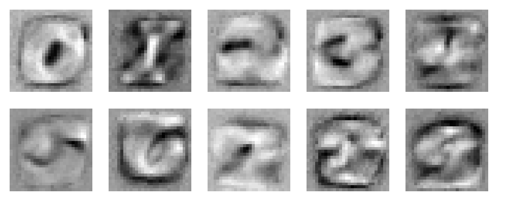
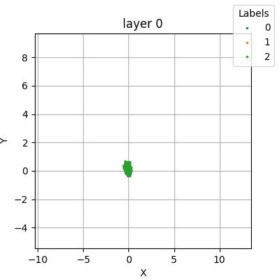

# The MNIST database

The MNIST is a database of handwritten digits of resolution $28 \times 28$ as below

In the following I use simple classifier comprised from linear layouts separated by ReLu layers,
and end with SoftMax.

## Study filters

The first linear layer always starts from dimension $28\times 28$ into some dimension $d$. 
For each one of these $d$ outputs we have $28 \times 28$ weights which in a sense filter
the image into that output. We can use these weights to draw an image and "see" what it learns.

In the case where we have a single linear layer, so there are 10 outputs, and each correspond 
to a different layer, we get the following image:

Once having more hidden layer, analysing the system becomes a bit harder...

Below is a short video of classifying 0/1 bit with $28^2 \to 10 \to 2$ model.

- In the top row we have the filter for each one of the 10 output of the first layer.
- While 10 node in a hidden layer make the system "more complicated" we still see that they all learn more or less the same 2 filters.
- As the filter are the weights of the linear part, above them in the title we have the bias.
- In addition, the second (and final) linear layer sends the output of each node in the hidden layer to the two classifying nodes of 0 and 1. The weights
  on these connections also appear in the title. Note that we can expect filter that look like 1 to have weights (low : high) and filter which look like zero to be (high : low).
- Since we classify 0/1, the output of the model is in 2D which we can plot (at the bottom left). This is done for any picture in the test data.
- Given such test point, applying the first layer gives the values for the middle hidden layer, which appear in the bar graph.
- Note that if the value there is negative (red), then the ReLu zeros it. This is why one of the filters looks like random noise - it is negative for all the test (and train) data, so it never really improved during the train process.

https://github.com/user-attachments/assets/f7af6583-a2e6-469c-8674-d4e1fa8033d0

## 2D separation

If a linear layer ends in dimension $2$, then we can easily plot its output in the plane
to get some intuition about what happens there. 
In the following, after each learning step, I ran the model on the testing data and 
see where it lands according to the labels. All simulation ran on the standard MNIST
dataset (restricted to the labels in each run) with batch size 64,
and one epoch unless stated otherwise.

### Classifying 0/1 labels

In this case, the final output is always 2D, which we can view, but we can also view
any mid layer which has output 2.

1. A single layer $(28 \times 28) \to 2$:
   Note that not only the colors are getting more separated as the learning progress, but
   the separation is with a line at the direction $x=y$, which is what SoftMax needs. The test
   error data at the end was around $0.0015$.
   

2. Two linear layers: $(28\times 28)\to 2\to 2$ :
   - Note how most of the blue points after layer 0 have negative $x$-value. This means that
   when ReLu is applied to them, they collapse into a line, which can be seen in layer 1.
   - Here too, we can separate the point with a line at the direction $x=y$. The test
   error data at the end was around $0.0015$.
   - Another interesting point to note that while we use 2 layers, the labels actually 
     become separated after the first layer 
   

3. Four linear layers: $(28\times 28)\to 2\to 2\to 2\to 2$ :
   - Applying ReLu layers, while break linearity, it also "collapses" $\frac{3}{4}$ of the information,
   namely points where $x\leq 0$ or $y\leq 0$. This is why it is not surprising that after 4 layers
   all the points are on the same line. We still have good separation with final error rate $\sim 0.002$.
   

4. Five linear layers: $(28\times 28)\to 2\to 2\to 2\to 2\to 2$ :
   - Too many ReLu layers collapse all the information to a single point at initialization, so almost
   no learning is possible (error rate was about $~0.45$).
   - Can a good choice of initialization solve this problem, maybe add offsets that make sure that
   most points will not fall in the negative parts of the plane?
   

### Classifying more labels

Here I used network with dimension $(28\times 28)\to 2 \to \text{num-labels}$.

1. Classify 0\1\2: With a single epoch:
   - Test error rate $\sim \frac{1}{3}$ which is way better than the $\frac{2}{3}$ for random guesses.
   - This is not so surprising, since while we do try to separate into 3 labels,
   in a 3-dimensional space on which the SoftMax runs, the SoftMax actually "cares"
   only about 2 dimension (since it is invariant under translations by constant vectors).
   

2. Classify 0\1\2: with 2 epochs, which ended up with error rate $~0.02$
   

3. Classify 0\1\2\3\4: with 2 epochs, which ended up with error rate $~0.43$ which 
   is better than the $\frac{4}{5}=0.8$ of random guesses. Can we get better separation (I should run it
   with more epochs later...). If not, is it because the 2 dimensions are just not enough to 
   classify 5 labels?
   

