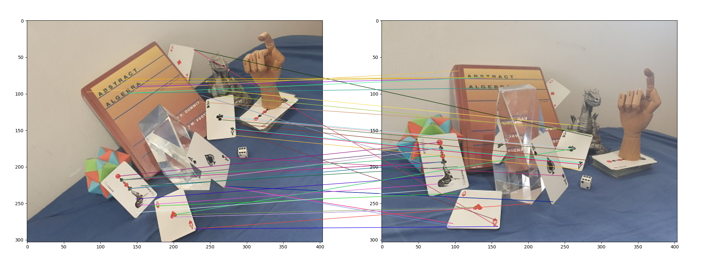
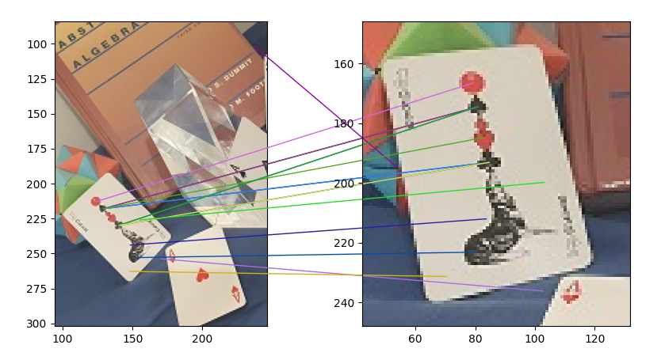
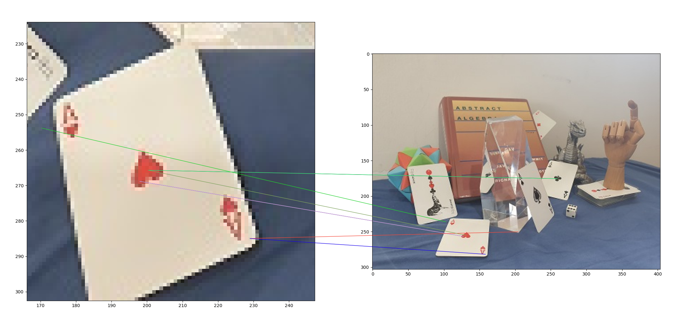
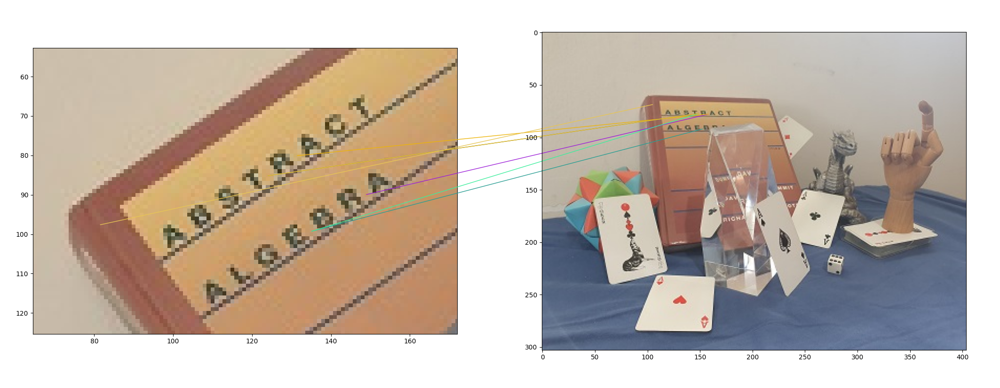
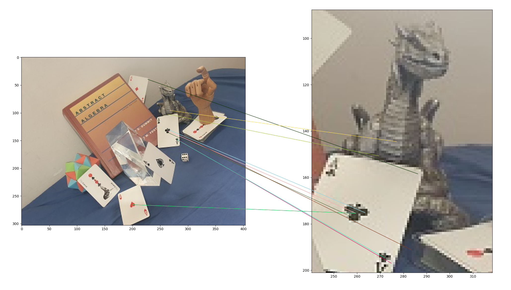

# SIFT comparisons

Some comparison results from my implementation of SIFT.

1. Two images of the same scene, from two different positions.
   Showing the best 50 comparison points:

2. Focusing on the Joker card, it seemed to do a decent job. The top ball is matches only with
   the top ball, though the card suit's symbol have a bit of a cross matching. This is porbably 
   because of the reduced resolution + the comparison is done on a grayscale version of the picture,
   and these symbols, are somewhat similar then.

3. Focusing on the Ace of hearts, again some decent matching. One "wrong" matching is the heart itself 
   which goes to the club symbol, like in the previous image. Both have the same size more or less and 
   have white background, so under grayscale they are close enough.

4. Just some abstract algebra...

5. Finally, the dragon head didn't have one of the first 50 matches, but his chest somehow does.
   Also, we got a match from the corner of the Ace of clubs card to the corner of the Ace of diamond.
   There are many card corners in the image, which raises the question of why this edge? My guess is 
   that while all corners "are similar", when viewing from an angle, they are not all $90$ degrees.
   Out of all the white corners, these are probably the most close in the angle that we see in the image.
