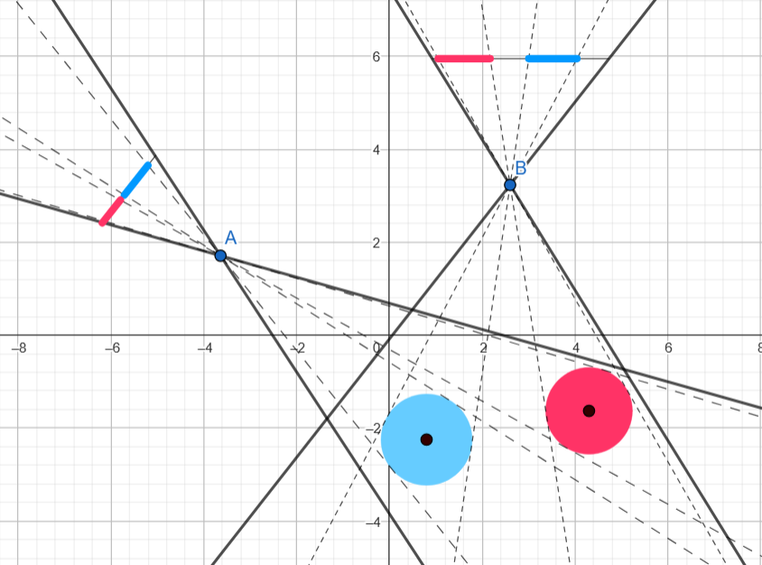

# Calibrating points of view

Consider the following problem:

### Problem:
> We are given some scene we which we from two different point of view in our 3D world.
> Each one produces a 2D image. Can we use these 2 images do determine the positions and orientations
> of the 2 points of view?

As example, consider the following 2D example:
- There are two points of view **A,B**.
- Both of them see the scene with the red and blue circles.
- When projected to their "1D" screen, they see different images. For example, in the **B**
    point of view, there is a larger gap between the projected circles.
- From just knowing the 2 projected scenes, can we find the position and orientation of the two points of view?

### Why is this important?

Suppose that we have two such images, and we can decipher the coordinates of the two points of view from them.
From just **A**'s point of view, we can tell in which direction the blue circle is, but not how far. It can be
very small and close to **A**, or very large and far away. The same holds for just **B**'s point of view.

However, if we have both **A** and **B**'s points of view, we know the directions from both of them towards the
blue circle, so it must be in the intersection! In other words, we can extract its position in the 2D space.
More generally, in our original problem, with 2D pictures of the scene, we can extract the 3D positions of the objects.

If both **A** and **B** are at the same position, but with different orientations, we can't really use the images
to measure distances. However, if we know both of the orientations, we can stitch the images together to form a panorama.

### Some obvious problems

Before we even try to solve this problem, we should note that it doesn't have a unique solution. Indeed, if for example 
we move both the scene and the 2 points of view by the same amount (say, add 2 to their $x$ positions), then we will get 
the same images, for different positions. Similarly, if we rotate everything around the same center and with the same angle.
Finally, if we scale everything by the same amount, it will not change the images.

More formally, each point of view can be determined by 
1) Its position in $\mathbb{R}^3$,
2) Its orientation, namely which direction is left, which is up and which is forward. These directions form a basis to the 
   space, which we can view as an invertible matrix. For our discussion here, we will assume that they form an orthonormal
   basis. In general, the first step is calibrating the camera so we can assume this, but I will ignore it in these notes.

### Notation:
> A point of view is a pair $(P,A)\in \mathbb{R}\times \mathrm{GL}_3(\mathbb{R})$, and usually $A\in SO_3(\mathbb{R})$.

To get rid of the obvious ambiguities mentioned above, we will assume the following normalizations:

1. The first point of view is at the origin.
2. It uses the standard axes as its orientations, namely its orientation matrix is the identity.
3. The second point of view is either at the origin, or at distance exactly 1 from it.

The third normalization distinguishes between two points of view which are at the same position (but can look at
different direction), and two points of views at different positions. In our original problem we assumed two distinct
positions, however the problem of the same position with different orientation is also important. For example,
if you take many pictures from the same position, and want to stitch them up together to form a panorama.

# Formalizing the problem

Suppose that we have a point of view $(P,A)\in \mathbb{R}^3\times \mathrm{GL}_3(\mathbb{R})$.

Given a point of interest $v\in \mathbb{R}^3$ in the space, in order to "view" it from this new point of view,
we need to write it as

$$ v = P + Au , u\in \mathbb{R}^3.$$

In other words, with respect to the point of view, the coordinates are actually $u$. However, we don't really see $u$,
but rather its projection to the 2D screen, namely:

$$u=\pmatrix{u_1\\ u_2 \\ u_3} \mapsto \pmatrix{u_1/u_3\\ u_2/u_3 \\u_3/u_3} = \pmatrix{u_1/u_3\\ u_2/u_3 \\1}.$$

### Remark:
> Ignore for now the case where $u_3=0$. These are considered "points at infinitely".

Similarly, when we view the point $v$ from the origin, we also see only its projection $\pmatrix{v_1/v_3\\ v_2/v_3 \\1}.$

### Probelm:
> Suppose that we know the projections of points $v^{(i)}, u^{(i)}$ for $i=1,...,n$. Find
> $P\in \mathbb{R}^3$ and $A\in \mathrm{GL}_3(\mathbb{R})$ such that:
> $$v^{(i)} = P+Au^{(i)},\; \forall i.$$

# Projective linear systems

In the problem above, if we actually knew both $v^{(i)}$ and $u^{(i)}$, then for each $i$ the equation above is actually three linear equations
in the entries of $P$ and $A$, and linear systems are easy to solve. However, since we only know the projection of the point,
the problem becomes much harder.

### Assumption
> Consider first the case where $P=0$

In the equation $v = Au$ we don't know $v$ and $u$, however we do know their projections $\tilde{v}=\frac{1}{v_3} v$ and $\tilde{u}=\frac{1}{u_3} u$.
 We can use these to obtain:
$$\tilde{v}=\frac{1}{v_3} v = \frac{1}{(Au)_3} Au = \frac{1}{(A\frac{1}{u_3}u)_3} A\left(\frac{1}{u_3}u\right) = \frac{1}{(A\tilde{u})_3} A\tilde{u}.$$

Rearranging this equation, we get:
$$(A\tilde{u})_3\tilde{v} = A\tilde{u}.$$

This is a system of linear equations in the entries of $A$! 

More specifically, the third entry of the equation above is always true $(A\tilde{u})_3=(A\tilde{u})_3$, and the other two entries are:
$$\sum_{j=1}^3 A_{3,j}\tilde{u}_j\tilde{v}_i = \sum_{j=1}^3 A_{i,j}\tilde{u}_j,\;\; i=1,2.$$
Equivalently, we have:
$$\pmatrix{\tilde{u}_1 & \tilde{u}_2 & 1 & 0 & 0 & 0 & -\tilde{u}_1\tilde{v}_1 & -\tilde{u}_2\tilde{v}_1 & -\tilde{v}_1 \\
           0 & 0 & 0 & \tilde{u}_1 & \tilde{u}_2 & 1 & -\tilde{u}_1\tilde{v}_2 & -\tilde{u}_2\tilde{v}_2 & -\tilde{v}_2  }
\pmatrix{A_{1,1}\\A_{1,2}\\A_{1,3}\\A_{2,1}\\A_{2,2}\\A_{2,3}\\A_{3,1}\\A_{3,2}\\A_{3,3}\\}
=\pmatrix{0\\0}$$

The matrix $A$ has 9 entries, and each pair $u,v$ gives us 2 equations, so 5 pairs should be enough. Or maybe not?

- The equation above has one obvious solution - take $A=0$. Indeed, this whole computation was just to find $A$ such that
$v$ and $Au$ are on the same line through the origin, which is automatically true when $A=0$.
However, $A=0$ cannot be a proper solution to our original problem, since it represent an orientation in space, and in 
particular must be invertible. In other words, we need a nonzero solution to the homogeneous system of linear equations 
above, as we run over the pairs $(v^{(i)}, u^{(i)})$. 
- Moreover, if $A\neq 0$ is a solution, then of course so is $\lambda A$ for any $\lambda \neq 0$ - it is a vector space 
after all. This means that if there is a nonzero solution it is not unique. This should not be too surprising, since
$A$ and $\lambda A$ represent the "same" orientation up to projection. The left, up and forward direction have the same 
direction but different magnitudes, and when we think of orientation, we only think of the directions without  the magnitudes. 
- Thus, we actually want the space of solutions to be of dimension 1, so up to a scalar multiplication (projectiveness)
there is a unique nonzero solution.

Ignoring a little bit all sorts of settings in our camera, we may assume that its forward, up and left directions form 
an orthonormal basis to the space, so that $A$ should actually be in $\mathrm{O}_3(\mathbb{R})$ and not just 
$\mathrm{GL}_3(\mathbb{R})$. 

To summarize, four pairs are already enough (assuming independence), and we look for a nonzero solution to the homogenous
equations from above.

# Geometric interpretation

In the previous section, we did some simple algebraic manipulations, and somehow moved from our original problem, to the
problem of solving a system of linear equations. In this section we will try to give some geometric interpration to this
manipulation.

In our problem, we know both $\tilde{v}$ and $\tilde{u}$, and in a sense we try to guess what are the original $v,u$ 
and use them to extract $A$. In other words we guess the scalar $\lambda_v, \lambda_u$ so that $v=\lambda_v \tilde{v}$ 
, and $u=\lambda_u \tilde{u}$ so that 
$$ \lambda_v \tilde{v} = A\lambda_u \tilde {u}.$$

Geometrically, this means that $\tilde{v},A\tilde{u}$ are on the same line. Since our images **only see projections**,
we only have information about the lines through the cameras and not absolute positions in the space.

### Question
> Let $(a_1,b_1,c_1), (a_2,b_2,c_2)$ be two nonzero points. How can we check if they are on the same line.

What we used in the previous section is that they are on the same line if we can write them as 
$$(a_1,b_1,c_1) = \lambda (a_2,b_2,c_2).$$
Then, if we take the ratio between the coordinates, then the extra $\lambda$ disappears:
$$\frac{a_1}{b_1} = \frac{\lambda a_2}{\lambda b_2} = \frac{a_2}{b_2}.$$

There is another way to check if they are on the same line. We can rewrite the equation above as:
$$0 = a_1\cdot b_2 - b_1 a_2 = \det \pmatrix{a_1 & b_1 \\ a_2 & b_2}.$$
We get similar equations for $(a,c)$ and $(b,c)$, and all of them together can be written compactly using the crossed product:
$$(a_1,b_1,c_1) \times (a_2,b_2,c_2) = (0,0,0).$$

Recall that in general, the crossed product computes $v\times u$ a vector perpendicular to both $v$ and $u$ and its size
is the area of the parallelogram generated by $v,u$. But when $v$ and $u$ are at the same direction, this area is zero.

Going back to our problem, finding $A$ for which $\tilde{v},A\tilde{u}$ are on the same line, is equivalent to
$$\tilde{v} \times A\tilde{u} = \bar{0},$$
and you should check that these are equivalent to the equations from the previous section.

### Remark
> In this formulation it is easy to see that the solutions is a linear space, since the map 
> $A\mapsto \tilde{v}\times A\tilde{u}$ is linear, and we are looking for its null space.

# Enters the noise

Up until now, we were in an ideal world, where we knew the exact positions of the pairs $(v^{(i)}, u^{(i)})$. However,
in the real world, trying to match the points from different images is not simple, and whatever algorithm we choose to
do it will usually add some noise to each point, and sometime match points which should not be together at all.

> How can we overcome this problem?

More formally, let's denote by $\overrightarrow{A}$ the column vector which consists of the entries of $A$, and for a 
pair $(v^{(i)}, u^{(i)})$ let $W^{(i)} \in \mathbb{R}^{2\times 9}$ be the matrix whose row correspond to the coefficients
in the homogeneous equation above, so we can rewrite it as
$$W^{(i)} \overrightarrow{A} = 0.$$
As we run over $i$, we can stack the matrices $W^{(i)}$ into a big $(2n)\times 9$ matrix $W$ to get the homogeneous equation
$$ W \overrightarrow{A} = 0.$$
This equation works in the ideal world, but in the noisy world we can at most require that $W \overrightarrow{A}$ will be 
as small as possible. As in the previous section, $A=0$ is still a solution that we want to avoid, so we add the restriction 
that $|A|=\sqrt{\sum A_{i,j}^2}=1$.

### Problem

> Given the matrix $W$, find a solution to 
> $$\min |W\overrightarrow{A}|\text{ , s.t. }|\overrightarrow{A}|=1.$$

This is no longer a standard problem of linear system of equation. Luckily for us, a little bit of geometry (=inner product spaces)
is all we need.

### Remark:
> You can solve it also using some Lagrange multipliers. However, for me at least, this never really gave any geometric
> intuition, so I prefer to think about it using inner products.

### Theorem:
> Let $B \in \mathbb{R}^{n\times n}$ be a symmetric real matrix. Then $B=Q^TDQ$ where $Q^{-1}=Q^T$ is an orthogonal matrix
> and $D$ is a diagonal matrix over $\mathbb{R}$.

The theorem above is a special case of spectral decomposition of normal matrices. The reason it is so useful in our case
is that
$$|W\overrightarrow{A}|=\overrightarrow{A}^T(W^TW)\overrightarrow{A},$$
and the matrix $W^TW$ is a real symmetric matrix. More over, it is positive semi definite, namely $x^TW^TWx \geq 0$ for 
all $x\in \mathbb{R}^3$, so the values on the diagonal $D$ above must be non negative as well. Finally, since multiplying
by an orthogonal matrix doesn't change the norm of a vector we obtain that:
$$\begin{align}\arg\min_A |W\overrightarrow{A}|&=\arg\min_A |\overrightarrow{A}^TW^TW\overrightarrow{A}|=\arg\min_A |(Q\overrightarrow{A})^T\cdot D \cdot (Q\overrightarrow{A})|\\
1&=|\overrightarrow{A}|=|Q\overrightarrow{A}|.\end{align}$$
In other words, we have the same problem, but with the diagonal matrix $D$ instead of $W^TW$, and of course, once we find 
the solution $Q\overrightarrow{A}$ we can extract $A$ from it.

### Problem
> Suppose that $D$ is diagonal with eigenvalues $0 \leq \lambda_1 \leq \lambda_2 \leq \cdots \leq \lambda_k$. 
>
> Find the solution to
> $$\arg\min_x |x^T D x|\;\text{ , s.t. } |x|=1.$$

Under this notation, the problem become very easy. Indeed, we can open it as:
$$\arg\min_x \sum_1^k \lambda_i x_i^2\;\text{ , s.t. } \sum_1^k x_i ^2=1.$$

Since the $x_i^2$ are nonnegative, we get that 
$$\sum_1^k \lambda_i x_i^2 \geq \lambda_1 \sum x_i^2 \geq \lambda_1,$$
and furthermore this minimum is attained when $x_i=0$ for $\lambda_i > \lambda_1$. In other words, the minimum is the 
smallest eigenvalue, and the vectors are the unit vectors over the eigenvectors for eigenvalue $\lambda_1$.

# Looking at the scene from different places

Recall that up to this point, we looked at the simpler case where $P=0$, namely the second point of view was at the origin
as well. We now turn to the more complicated case where $P\neq 0$ and the 2 points of view are at distinct positions.

Recall that given the projections of $u,v$ we wish to find $A,P$ such that 
$$v = P+Au.$$

Trying the same trick from the $P=0$ will not work, since:

$$\tilde{v}=\frac{1}{v_3} v = \frac{1}{(P+Au)_3} (P+Au) = \frac{1}{(\frac{1}{u_3}P+A\frac{1}{u_3}u)_3} \left(\frac{1}{u_3}P+A\left(\frac{1}{u_3}u\right)\right) = \frac{1}{(\frac{1}{u_3}P+A\tilde{u})_3} \left(\frac{1}{u_3}P+A\tilde{u}\right).$$
We switched from the $u,v$ vectors to their projections $\tilde{u}, \tilde{v}$, but we could not get rid of the normalization
scalar $u_3$, because it still divides $P$. However, we are not too far off.

We already saw that this simple algebraic manipulation that worked before, can be done much cleaner using cross products:
$$0 = v\times v = v\times P + v\times Au.$$
Instead of three terms, we only have two. To get rid of another term, recall that $v\times P$ is perpendicular to both $P$
and $v$ so let's take the inner product with $P$ (why not $v$?):
$$0=\left\langle P,0 \right\rangle=\left\langle P,v\times P \right\rangle+\left\langle P,v\times Au \right\rangle = \left\langle P,v\times Au \right\rangle.$$
The notation is a bit more complicated, but it is now one big product, which is linear in both $A$ and $P$. If we knew 
one of them, we could have used this equation to look for the other, just like in the $P=0$ case, but unfortunately we 
need to find them both.

The solution to this problem, is just as before: let's try to move all the "problems" into a single place. More formally
instead of taking $v\times$ and then $\left\langle P, \cdot \right\rangle$, we switch it into $P\times$ and then $\left\langle v, \cdot \right\rangle$. 
This will give us:
$$0=\left\langle v, P \times v \right \rangle = \left\langle v, P\times (Au) \right \rangle.$$

The crossed product $x\mapsto P\times x$ is a linear map, so we can express it as multiplication by a matrix $[P_\times]$:
$$P\times x = \pmatrix{0 & -P_3 & P_2 \\P_3 & 0 & -P_1 \\-P_2 & P_1 & 0 } x$$

All together, we got the equation:
$$v^T ([P_\times] A) u = 0.$$

Setting $F:=[P_\times] A$, here too we have a homogenous linear equation in the entries of $F$, which is unaffected by multiplying 
either $u$ or $v$ by nonzero scalars. As we are looking for a nonzero solution, 8 such (independent) equations should be enough.

### Question:
>Knowing $[P_\times] A$, how can we extract $P$ and $A$?

Recall that $A$ is an invertible matrix, and when $P\neq 0$, the matrix $[P_\times]$ is of rank 2 (check to see that you
know why!). It follows that the solutions to:
$$w^T [P_\times] A = 0,$$
forms a 1-dimensional space, and since it contains $P\neq 0$, it is exactly $span\{P\}$. In other words, up to a 
scalar multiplication, we can find $P$.

If $[P_\times]$ was invertible, then we could have easily found $A=[P_\times]^{-1}F$. However, this doesn't hold here,
so we need some way to extract the rank 2 part from $F$, while keeping $A$ intact. Luckily for us, both $[P_\times]$ and
$A$ have nice geometric structure that we can use: 
- $[P_\times]$ is a **skew symmetric** real matrix,
- $A$ is an orthogonal matrix, with determinant 1.

As this is a bit more technical, and has some independent mathematical interesting ideas, I put it in a 
[different document here](skew_symmetric_orthogonal.md).

# Matching points in images

At this point we had the original matching between the two images $\tilde{u}=\frac{1}{u_3}u \sim \frac{1}{v_3}v=\tilde{v}$ 
and we found both $P$ and $A$ (under the scaling assumption that $|P|=1$), such that 
$$P+Au = v.$$
We still need to find the actual $v$, which can be done, for example, by taking the cross product with $A\tilde{u}$:
$$P \times \left(A\tilde{u}\right) = v_3 \left(\tilde{v}\times A\tilde{u}\right).$$
We can compute both $[P_\times]A\tilde{u} = P\times \left(A\tilde{u}\right)$, and $\left(\tilde{v}\times A\tilde{u}\right)$
in order to find $v_3$.

### Remark:
> If $v$ and $Au$ are at the same direction, then both side of the equations are 0, and we couldn't find $v_3$. 
> This only happens when $P=v-Au$ is also the same direction, so both cameras and the object are on the same line, so 
> there is no real way to find the depth of the object.

Originally, we ran some algorithm to find enough matching points so we could find $A$ and $P$. However, this algorithm 
usually don't give us a matching for every point in the image, as this can be a very computationally hard problem.

However, now we have some clues which can help us do this full matching. Suppose that we are given a point in the first
image $\tilde{v}$ and we want to find a match in the second image $\tilde{u}=\pmatrix{\tilde{u}_1 \\ \tilde{u}_2 \\ 1}$. We know that these points satisfy
$$\tilde{v}^T [P_\times] A \pmatrix{\tilde{u}_1\\ \tilde{u}_2\\1} = 0,$$
and all but $\tilde{u}_1, \tilde{u}_2$ are given, so this is an equation of a line. So now, we only need to check the 
pixels along this line for a good matching.